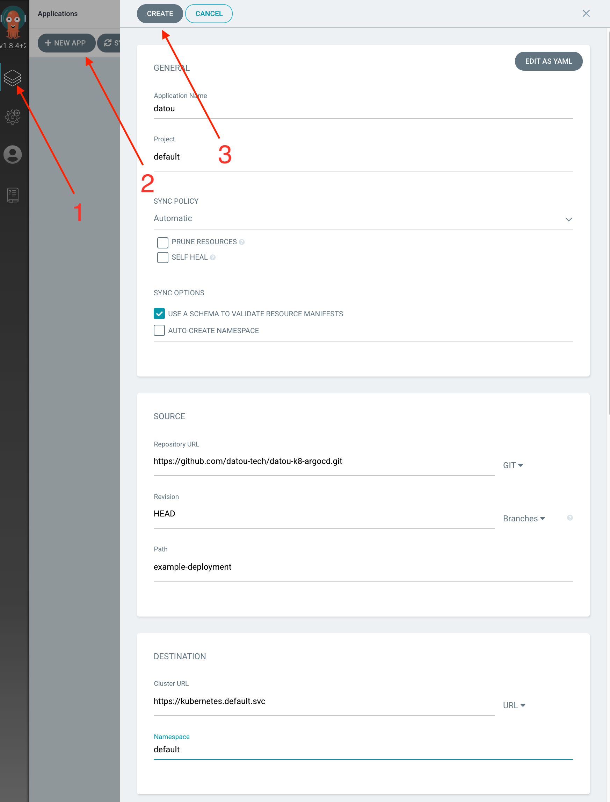
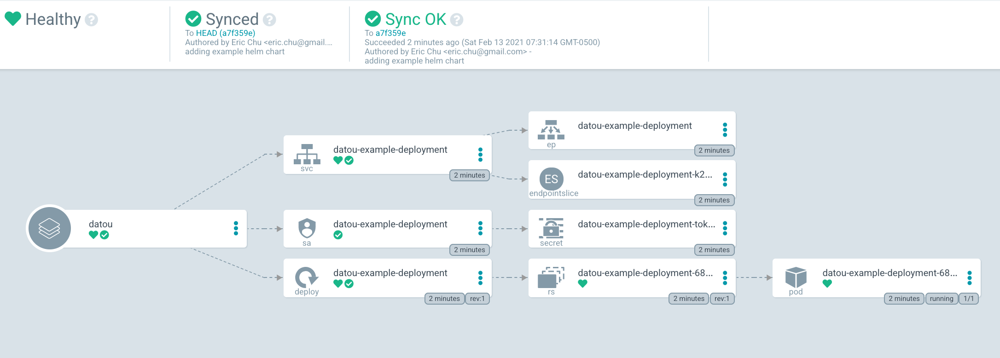
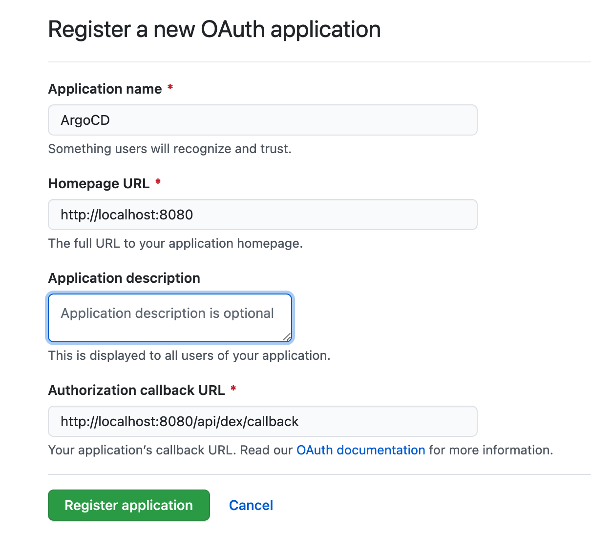
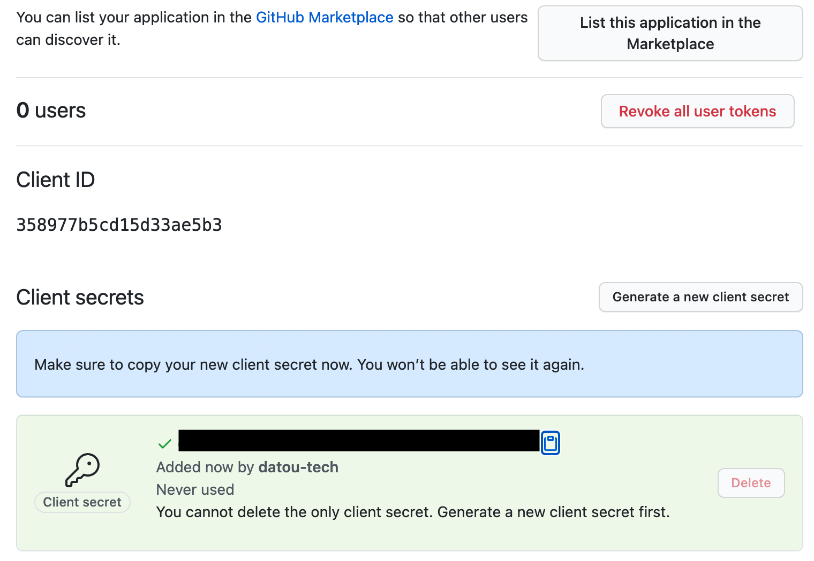

## datou-k8-argocd
---

### Summary
The goal of this project is to provide a guided walkthrough for ArgoCD. We will walkthrough the base ArgoCD application and then inspect an additional utility that provides more deployment options (ie, canary and blue/green releases). Many of the documentation here is already provided within these resources:

- [Main ArgoCD Project](https://argoproj.github.io/argo-cd/)

### Pre-requisite

You will need a cluster to run the steps in this project. If you are following the datou series, you will need these projects completed.

- datou-k8 - [set up a local cluster](https://github.com/datou-tech/datou-k8)
- datou-k8-helm - [understand helm charts](https://github.com/datou-tech/datou-k8-helm)
- datou-k8-docker - [understand packaging applications](https://github.com/datou-tech/datou-docker)

### Install ArgoCD

1. Install ArgoCD
    ```
    kubectl create namespace argocd
    kubectl apply -n argocd -f https://raw.githubusercontent.com/argoproj/argo-cd/stable/manifests/install.yaml
    ```

### ArgoCD Server/GUI

ArgoCD offers a GUI and a CLI for management and configuration.

1. Inspect the ArgoCD resources - `kubectl get po -n argocd`
1. Open connection via Port Forwarding - `kubectl port-forward svc/argocd-server -n argocd 8080:443`
1. Open the GUI at `http://localhost:8080`
1. Default user is `admin` and password is the name of the pod from step 1 (ie, `argocd-server-56ffccb4cd-mthm6`)

### ArgoCD CLI

1. Install ArgoCD CLI - `brew install argocd`
1. How to login - `argocd login localhost:8080`
1. Update Password - `argocd account update-password`
1. Read up on more argocd CLI resources and commands [here](https://argoproj.github.io/argo-cd/user-guide/commands/argocd/)

### Deploying an Application

ArgoCD uses the [GitOps](https://www.gitops.tech/) methodology for continuous delivery. What you declare in Git is what ArgoCD will sync into your cluster. Each step will illustrate the GUI implementation with the accompanying CLI command.

1. First, we will declare an ArgoCD `Application` which wraps a native K8 deployment in a Custom Resource Definition (CRD). (See example-deployment folder)



```
    # CLI equivalent command to create
    argocd app create datou \
    --repo https://github.com/datou-tech/datou-k8-argocd.git \
    --path example-deployment \
    --dest-server https://kubernetes.default.svc \
    --dest-namespace default \
    --sync-policy auto
```

2. Next, inspect the application deployment. Click around to see the resources.



```
    > argocd app get datou
    Name:               datou
    Project:            default
    Server:             https://kubernetes.default.svc
    Namespace:          default
    URL:                https://localhost:8080/applications/datou
    Repo:               https://github.com/datou-tech/datou-k8-argocd.git
    Target:
    Path:               example-deployment
    SyncWindow:         Sync Allowed
    Sync Policy:        Automated
    Sync Status:        Synced to  (a7f359e)
    Health Status:      Healthy
```

### [Optional] Github Authentication

Connecting the authentication via Github SSO. For this section, you will need a Github Account. These steps are already outlined [here](https://argoproj.github.io/argo-cd/operator-manual/user-management/#dex) but hopefully these steps will simplify it for our specific local cluster setup.

1. Create Github OAuth Application
    - Login to Github.com
    - Settings > Developer Settings > OAuth Apps



2. Create a new client secret



3. Edit the argocd configmap to configure oauth - `kubectl edit configmap argocd-cm -n argocd`

4. Modify

```
data:
  url: http://localhost:8080

  dex.config: |
    connectors:
      # GitHub example
      - type: github
        id: github
        name: GitHub
        config:
          clientID: <CLIENT_ID>
          clientSecret: <CLIENT_SECRET>
          #orgs:
          #- name: your-github-org

```

5. NOTE: when logging in, you will need to re-write your URL to `http` for this local example since the DEX handshake automatically uses `https`. 

```
    https://localhost:8080/auth/login?return_url=https%3A%2F%2Flocalhost%3A8080%2Fapplications
                                                     ^
                                                     # change to http
```
